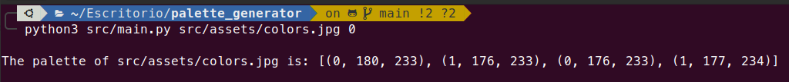
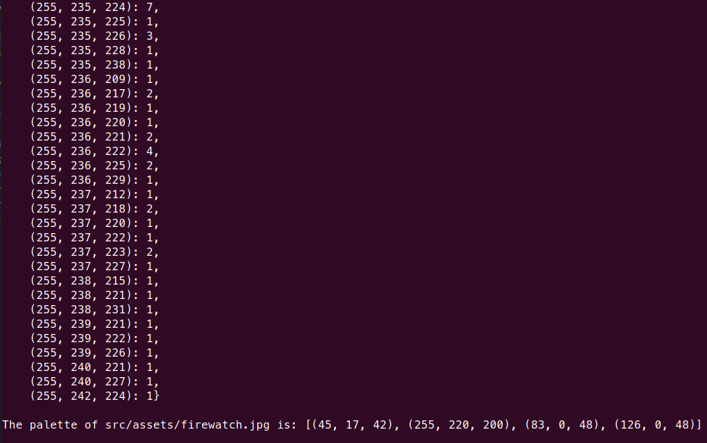

# palette_generator

## How to use it

```
python3 main.py [...] [...]
```

First argument: 

- Image path (i.e. src/assets/colors.jpg)

Second argument:

- 0: simple output, just the palette in RGB format.
- 1: complete output, the complete set of colors of the picture and the simple output.

## Examples

### Example #1:

#### Input

```
python3 src/main.py src/assets/colors.jpg 0
```
#### Output



### Example #2:

#### Input

```
python3 src/main.py src/assets/firewatch.jpg 1
```
#### Output

